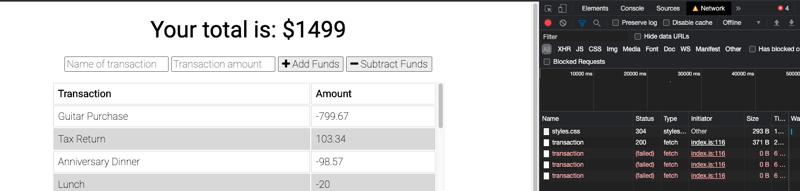
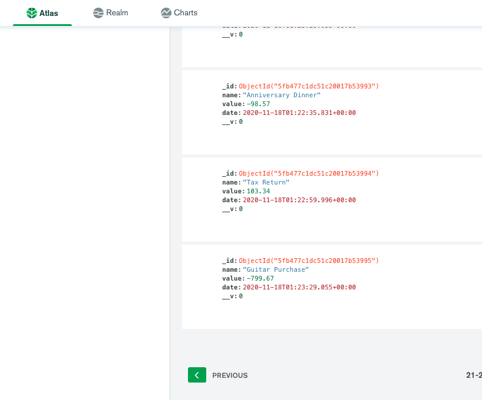

# Progressive_Budget

This app is designed to be able to be used if connectivity is sparse or if connectivity is unavailable.

If connectivity is unavailable, the app will still cache the data and make it available when the connection is restored.

As you can see, the data is stored, even though the Network is "offline".

After connectivity is restored, the database is updated with the latest changes to the budget.

